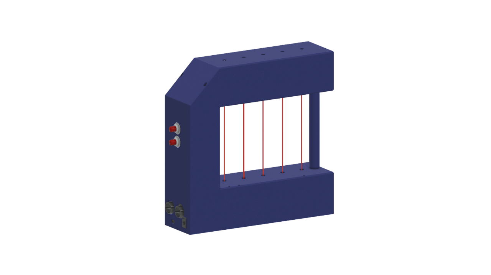

# MIDI Laser Harp

Questo progetto è stato realizzato come parte dell’esame del corso **Laboratorio di Making** (Anno Accademico 2024/2025) presso il **Corso di Laurea Magistrale in Informatica, Università di Bologna**.  

  

## Descrizione del progetto
Il mio lavoro ha avuto come obiettivo la progettazione e realizzazione di un **controller MIDI a forma di arpa laser**, capace di interagire con software musicali (come Ableton, Logic o altri DAW) attraverso messaggi MIDI.  

Il funzionamento si basa sull’utilizzo di fasci laser proiettati su sensori LDR: l’interruzione di un raggio viene interpretata come l’attivazione o il rilascio di una nota (Note On/Off).  
Oltre al nucleo principale, sono stati integrati:
- **LED di feedback**, per fornire riscontro visivo all’utente;
- **sensore a ultrasuoni**, per il controllo continuo di parametri MIDI (ad esempio effetti o modulazione);
- **pulsanti per il cambio di ottava**, che estendono la gamma musicale dello strumento;
- un **software di configurazione** in grado di ricevere e inviare messaggi *Control Change* per la rimappatura delle note e il monitoraggio dello stato del dispositivo.  

## Modello CAD
La struttura fisica dello strumento è stata progettata in **Autodesk Fusion 360** e realizzata tramite **stampa 3D FDM**. 
  

## Tecnologie utilizzate
- **Arduino + MIDIUSB** per la gestione dei messaggi MIDI
- **NewPing** per il sensore a ultrasuoni
- **Autodesk Fusion 360** per la modellazione CAD
- **Ultimaker Cura** e **Ultimaker3** per la stampa 3D
- **Ableton Live** come DAW di riferimento per i test

## Struttura della repository
- `src/` → codice Arduino (per dispositivo) e Python (per software di configurazione)
- `stl/` → modelli 3D in formato STL
- `docs/` → immagini e documentazione aggiuntiva

## Autore
Progetto realizzato da **Leonardo Vorabbi**  
Università di Bologna – Corso di Laurea Magistrale in Informatica  
Laboratorio di Making, A.A. 2024/2025

