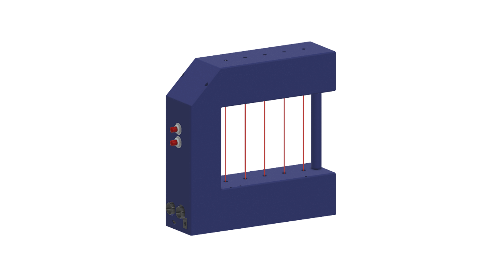

# MIDI Laser Harp

> **University Project** — Making Lab Course, A.Y. 2024/2025  
> Alma Mater Studiorum — Università di Bologna  
> Author: [Leonardo Vorabbi](https://github.com/leovora)

---

This project was developed as part of the **Making Lab** course exam (Academic Year 2024/2025) at the **Master's Degree in Computer Science, University of Bologna**.

## Project Description
The goal of my project was to design and build a **laser harp MIDI controller**, capable of interacting with music software (such as Ableton, Logic, or other DAWs) through MIDI messages.

The system works by projecting laser beams onto LDR sensors: interrupting a beam is interpreted as triggering or releasing a note (Note On/Off).

In addition to the core functionality, the following features were integrated:
- **Feedback LEDs**, to provide visual feedback to the user;
- **Ultrasonic sensor**, for continuous control of MIDI parameters (e.g. effects or modulation);
- **Octave shift buttons**, to extend the musical range of the instrument;
- a **configuration software** able to send and receive *Control Change* messages for note remapping and device status monitoring.

## CAD Model
The physical structure of the instrument was designed in **Autodesk Fusion 360** and built using **FDM 3D printing**.

## Technologies Used
- **Arduino + MIDIUSB** for MIDI message handling
- **NewPing** for the ultrasonic sensor
- **Autodesk Fusion 360** for CAD modeling
- **Ultimaker Cura** and **Ultimaker 3** for 3D printing
- **Ableton Live** as the reference DAW for testing

## Repository Structure
- `src/` → Arduino code (for the device) and Python code (for the configuration software)
- `stl/` → 3D models in STL format
- `docs/` → images and additional documentation

## Author
Project developed by **Leonardo Vorabbi**  
University of Bologna – Master's Degree in Computer Science  
Making Lab, A.Y. 2024/2025
